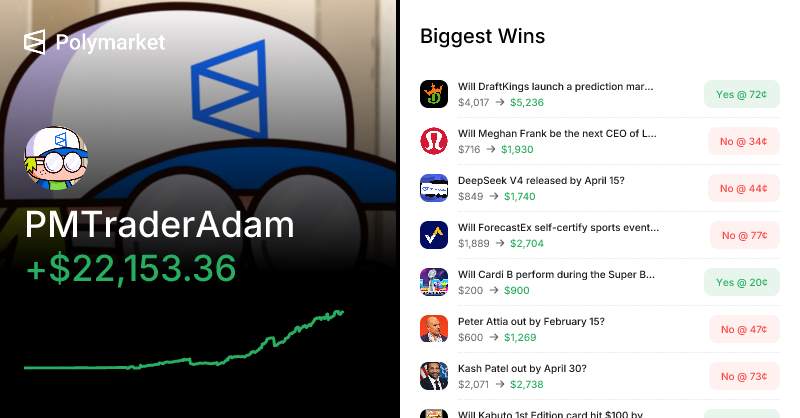
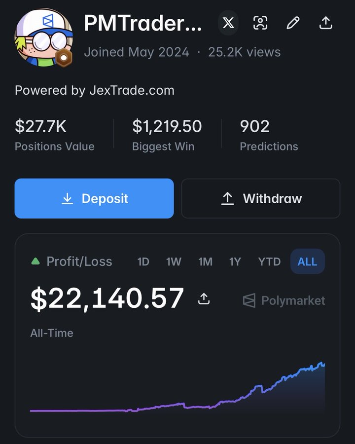
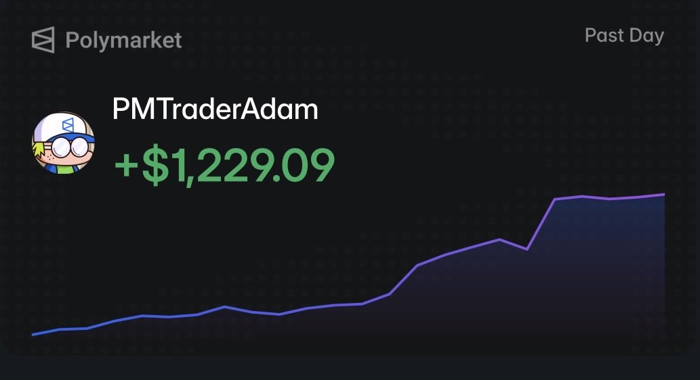

# PMTraderAdamBot — Polymarket Late-Window Snipe

> **Open-source TypeScript bot** for Polymarket **5-minute crypto Up/Down** markets — **BTC, ETH, SOL, and XRP**.

**Repository:** [github.com/PMTraderAdam/pm-copy-trader](https://github.com/PMTraderAdam/pm-copy-trader) · **Author:** [@PMTraderAdam](https://github.com/PMTraderAdam)

This bot implements a **late-window resolution snipe**: wait until the outcome is nearly decided, buy the favorite at **~$0.98–$0.99**, then hold to resolution for a small payout on each winning cycle.

**Live profile using this strategy:** [**@PMTraderAdam on Polymarket**](https://polymarket.com/@PMTraderAdam)

This repository reads live Polymarket prices and **simulates** the same entry/exit logic (console + `logs.txt`). Press **Ctrl+C** to stop and see balance, P/L, and trade count.

---

## Live proof — buy → redeem cycles

These are real on-chain transactions from [@PMTraderAdam](https://polymarket.com/@PMTraderAdam) on Polygon. Each pair shows the same pattern the bot follows: **buy the favorite late in the window → redeem at $1.00 after resolution**.

> **How to read these txs:** The **buy** tx interacts with `Polymarket: CTF Exchange V2` — USDC out, outcome shares in. The **redeem** tx settles winning shares back to USDC at **$1.00** per share when the 5m window resolves. Repeat this across many windows and P/L compounds — see the full history on [polymarket.com/@PMTraderAdam](https://polymarket.com/@PMTraderAdam).

### Profile screenshots ([@PMTraderAdam](https://polymarket.com/@PMTraderAdam))

Live results from the strategy this bot automates — consistent execution across crypto up/down markets and event-driven positions.

<table>
  <tr>
    <td width="50%" align="center" valign="top">
      
      <p><strong>All-time edge</strong><br />
      <sub>+$22K realized profit with a steady equity curve and documented high-conviction wins across sports, tech, and macro markets.</sub></p>
    </td>
    <td width="50%" align="center" valign="top">
      
      <p><strong>Live dashboard</strong><br />
      <sub>900+ resolved predictions, $27K+ positions value, and a compounding PnL curve — the same execution stack this binary runs in production.</sub></p>
    </td>
  </tr>
  <tr>
    <td width="50%" align="center" valign="top">
      
      <p><strong>Daily momentum</strong><br />
      <sub>+$1,229 in a single session — delta-momentum entries firing on short-interval crypto up/down windows when price breaks threshold.</sub></p>
    </td>
    <td width="50%" align="center" valign="top">
      
      <p><strong>Battle-tested</strong><br />
      <sub>Competing in the Hive World Cup on a $500 bankroll — the same risk-adjusted sizing model in the default config.</sub></p>
    </td>
  </tr>
</table>

<p align="center">
  <sub>Past performance does not guarantee future results. See <a href="#disclaimer">Disclaimer</a>.</sub>
</p>

---

## How it works

Each **5-minute Up/Down** market (BTC, ETH, SOL, XRP) runs for **300 seconds**. All four assets share the same window clock — every 5 minutes a new round opens for each.

```
0s ──────────────── 250s ─── 290s ─ 298s ─ 300s
     wait / monitor      entry      exit   close
                         window    (resolve)
```

Near the end, when price has usually already moved one way, the likely winner trades just below **$1.00**:

1. **Monitor all four markets** (BTC, ETH, SOL, XRP) each poll
2. **Wait** through most of the window — no early entries
3. **Enter** in the last ~40s when Up or Down is priced **$0.97–$0.99**
4. **Buy the favorite** — up to **one position per asset** per window
5. **Hold to resolution** at **t = 298s** and settle

| | Typical win | Risk |
|---|-------------|------|
| **Math** | Buy @ ~$0.98 → redeem @ **$1.00** ≈ **2%** gross per share | Last-second reversal → most of stake lost |
| **Edge** | Small, repeatable gain per window | One bad flip wipes many wins |

---

## Strategy rules

| Setting | Value |
|---------|--------|
| Markets | **BTC, ETH, SOL, XRP** — 5m Up/Down (`btc-updown-5m`, `eth-updown-5m`, `sol-updown-5m`, `xrp-updown-5m`) |
| Positions | Up to **one trade per asset** per 5m window (max 4 concurrent) |
| Entry time | **250–290s** after window start |
| Entry price | Favorite ask **0.97–0.99** (usually **0.98–0.99**) |
| Side selection | Whichever side is in the band; if both qualify, pick the **higher** price |
| Exit | **t = 298s** — redeem @ **$1.00/share** if bid ≥ 0.90, else exit at market bid (loss) |
| Position size | **$10** per trade (`BET_USD` in code) |
| Fees (simulation) | **1%** on notional; **0.5%** slippage on loss exits |

Many windows produce **no trade** — normal when no side reaches the price band before time runs out.

---

## Features

- Late-window favorite snipe on **BTC, ETH, SOL, XRP** 5m Up/Down markets
- Live Polymarket price polling (Gamma + CLOB APIs)
- Simulated entry/exit with P/L tracking
- One position per asset per window (max 4 concurrent)
- Tunable constants in [`src/index.ts`](src/index.ts)
- Runtime logs to console and **`logs.txt`**

---

## Requirements

- **Node.js** ≥ 20.6 ([`package.json`](package.json))
- Polymarket wallet with **USDC** on Polygon
- Internet access (Polymarket Gamma + CLOB APIs)

---

## Run from source

### 1. Install

```bash
git clone https://github.com/PMTraderAdam/pm-copy-trader.git
cd pm-copy-trader
npm install
```

### 2. Environment

```bash
# Windows
copy .env.example .env

# macOS / Linux
cp .env.example .env
```

| Variable | Required | Description |
|----------|----------|-------------|
| `PM_PRIVATE_KEY` | **Yes** | 64-character hex private key (with or without `0x`) |
| `PROXY_WALLET_ADDRESS` | No | Polymarket proxy/funder address for email or social-login accounts |

**Wallet setup**

| Account type | What to set |
|--------------|-------------|
| MetaMask / hardware wallet | `PM_PRIVATE_KEY` only — USDC in that EOA |
| Polymarket.com (email / Google) | Both `PM_PRIVATE_KEY` **and** `PROXY_WALLET_ADDRESS` (your profile address under Polymarket account settings) |

Never commit `.env`.

### 3. Run

```bash
npm start
```

Optional build:

```bash
npm run build
```

On startup the bot connects to Polymarket feeds and begins monitoring configured markets. Press **Ctrl+C** to stop and see balance, P/L, and trade count.

---

## Reading the logs

| Message | Meaning |
|---------|---------|
| `New 5m window (BTC, ETH, SOL, XRP)` | New 5-minute round for all assets |
| `BTC Up=0.98 Down=0.02 \| ETH …` | Heartbeat — prices across markets |
| `Late entry window in 120s` | Waiting until t=250s |
| `Watching for late favorite @0.98–0.99...` | In entry window, price in band on at least one market |
| `[ENTRY] ETH BUY Up (favorite) @ 0.98` | Late snipe on Ethereum 5m market |
| `[EXIT] BTC REDEEM Up @ 1.00 (resolution @ $1.00)` | Win — settled at $1/share |
| `[EXIT] SOL SELL … (favorite lost — exit at bid)` | Loss on Solana market |
| `Wallet balance is $0` | Deposit USDC or fix `PROXY_WALLET_ADDRESS` |

History is appended to **`logs.txt`**.

---

## Example simulation runs

Simulated terminal runs (market conditions vary):

| Starting balance | Per-trade size | Profit (example) |
|------------------|----------------|------------------|
| $100 | $10 | ~$40 |
| $500 | $50 | ~$300 |
| $1,000 | $100 | ~$500 |

These differ from the live [@PMTraderAdam](https://polymarket.com/@PMTraderAdam) results above — the repo **simulates** logic locally; your real P/L depends on balance, sizing, and how often each asset hits the 0.97–0.99 band.

---

## Tuning in code

Constants in [`src/index.ts`](src/index.ts):

| Constant | Default | Purpose |
|----------|---------|---------|
| `MARKETS` | `btc, eth, sol, xrp` | Assets to monitor |
| `BET_USD` | `10` | Dollars per trade (per asset) |
| `ENTRY_TIME_MIN` / `ENTRY_TIME_MAX` | `250` / `290` | Entry window (seconds) |
| `ENTRY_PRICE_MIN` / `ENTRY_PRICE_MAX` | `0.97` / `0.99` | Favorite price band |
| `RESOLVE_SEC` | `298` | Settlement time |
| `FEE_BPS` | `100` | 1% fee |

---

## Project layout

```
pm-copy-trader/
├── src/index.ts      # Bot logic and strategy constants
├── .env.example      # Environment template
├── logs.txt          # Runtime logs (created on start)
├── package.json
└── tsconfig.json
```

---

## Risks & disclaimer

> **Trading prediction markets involves substantial risk of loss.**  
> This software is provided **as-is** for educational and personal use only.

- **Small edge, large tail risk** — ~$0.02/share at $0.98 entry; one reversal can erase many wins.
- **Not every window trades** — many cycles never hit 0.97–0.99 in time.
- **This repo simulates P/L** — live trading requires CLOB order placement and real fills; past on-chain results ([@PMTraderAdam](https://polymarket.com/@PMTraderAdam)) do not guarantee future performance.
- **Not financial advice** — use at your own risk. Always start with small amounts and paper trade when possible.

---

## License

This project is open source and available under the ISC License.
